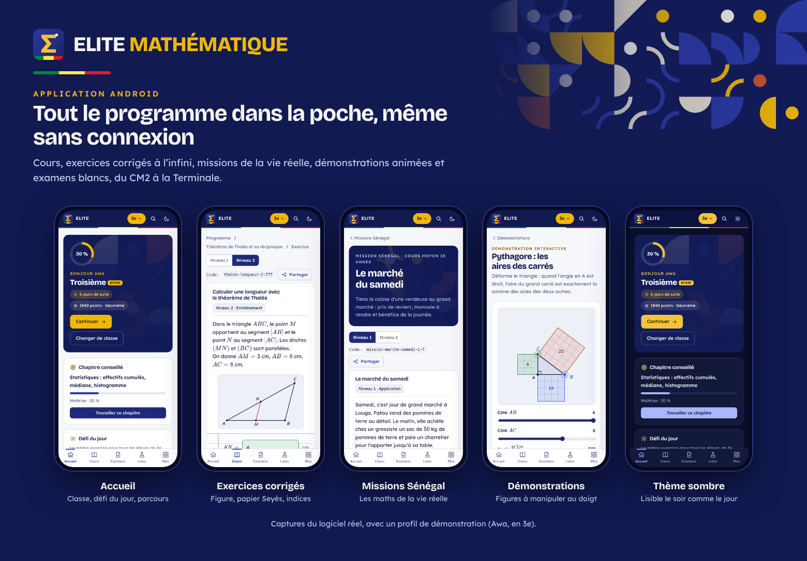
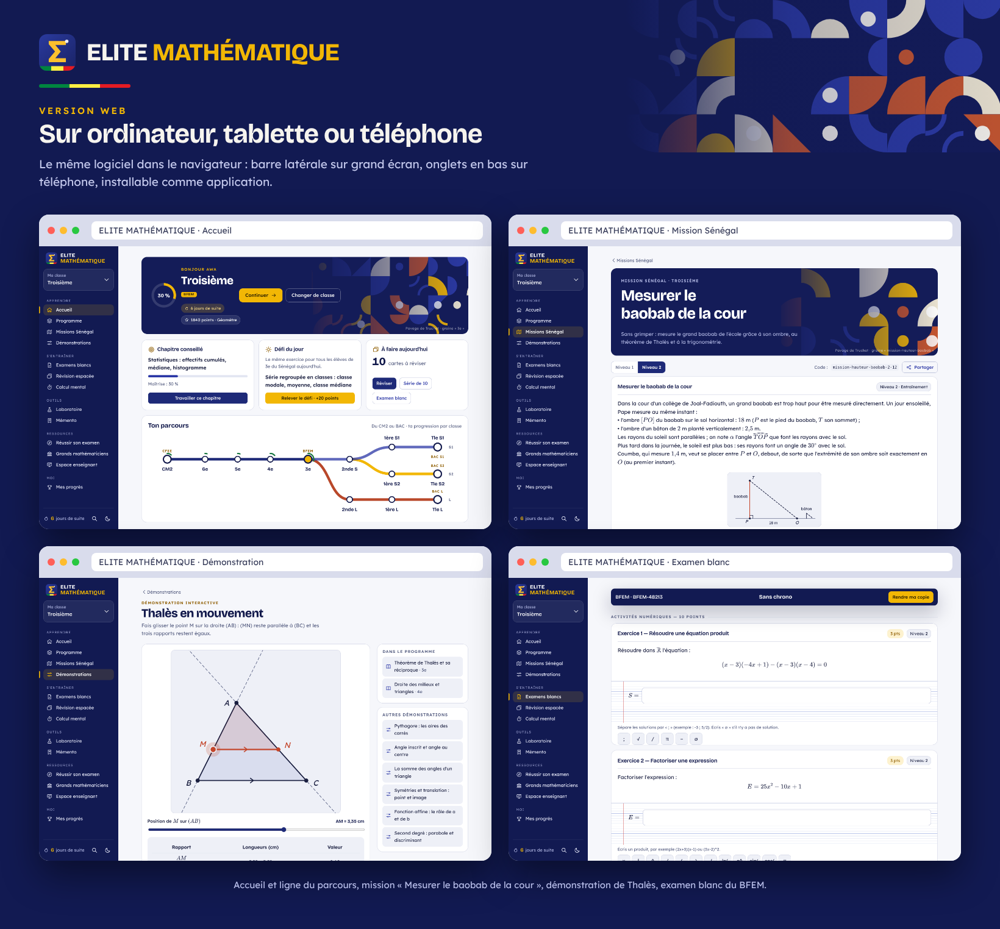

# ELITE MATHÉMATIQUE

**Le programme sénégalais de mathématiques, du CM2 à la Terminale, transformé en logiciel interactif.**
Gratuit, utilisable sur téléphone, et fonctionnant **sans connexion internet** une fois ouvert.





## Ce que contient le logiciel

| Rubrique | Contenu |
|---|---|
| 📚 **Programme** | CM2 (CFEE), 6e, 5e, 4e, 3e (BFEM), 2nde S et L, 1ère S1, S2 et L, Terminales S1, S2 et L (BAC). Pour chaque chapitre : objectifs, cours (définitions, théorèmes, formules), méthodes pas à pas, exemple corrigé, pièges fréquents, problème tiré de la vie au Sénégal, anecdote historique. |
| ♾️ **Exercices à l'infini** | Des générateurs créent des exercices toujours nouveaux, sur 3 niveaux, avec indices progressifs, vérification automatique de la réponse et correction détaillée. |
| 🔗 **Code d'exercice** | Chaque exercice a un code : le même code redonne exactement le même exercice, ce qui permet de le partager entre élèves et professeurs. |
| 🗺️ **Missions Sénégal** | 22 projets de la vie réelle, au moins un par classe (marché du samedi, facture d'eau, baobab de la cour, tontine, pirogue, élevage de tilapias…) : chacun mobilise plusieurs chapitres en 4 à 6 questions guidées. |
| 🎛️ **Démonstrations animées** | 16 figures à manipuler au doigt, à la souris ou au clavier : Thalès, Pythagore, angle inscrit, cercle trigonométrique, nombre dérivé, suites, intégrale, loi binomiale, nombres complexes… |
| ☀️ **Défi du jour** | Le même exercice pour tous les élèves d'une classe, le même jour, à partager sur WhatsApp. |
| 🩺 **Diagnostic** | Un test rapide repère les chapitres fragiles et propose un parcours de remédiation ; le « test des prérequis » remonte aux classes précédentes. |
| 📝 **Examens blancs** | CFEE, BFEM (activités numériques et géométriques), BAC S1, S2 et L (exercices et problème), devoirs surveillés : chronométrés, notés sur 20 avec mention, corrigés. Un code de sujet permet à toute une classe de composer sur le même sujet. |
| 🗂️ **Révision espacée** | Cartes de définitions et de formules, présentées selon la méthode des boîtes de Leitner. |
| ⏱️ **Calcul mental** | Soixante secondes chrono, quatre niveaux (tables, décimaux, relatifs, expert), record personnel. |
| 🧭 **Réussir son examen** | Guides du CFEE, du BFEM, du BAC S et du BAC L, et méthodes de travail : déroulement de l'épreuve, gestion du temps, rédaction, erreurs à éviter, liste de contrôle. |
| 🏛️ **Grands mathématiciens** | 31 portraits, dont 8 d'Afrique, de l'os d'Ishango à l'AIMS de Mbour, reliés aux chapitres du programme. |
| 📒 **Mémento** | Toutes les définitions, propriétés et formules d'une classe sur une page, imprimable. |
| 🧪 **Laboratoire** | Grapheur (zéros, extremums, intersections, dérivée, tableau de valeurs), calculatrice exacte, second degré pas à pas, systèmes par pivot de Gauss, arithmétique (Euclide, Bézout), statistiques (une et deux variables), probabilités (loi binomiale), nombres complexes, cercle trigonométrique, conversions d'unités. |
| 👩🏾‍🏫 **Espace enseignant** | Fiches d'exercices imprimables avec corrigé, et leur version interactive pour les élèves (lien à partager). |
| 🏆 **Progrès** | Maîtrise par chapitre, carte de maîtrise de tout le programme, points, rangs, badges, série de jours, historique des examens, export et import de la progression. |

## Identité visuelle

« Encre indigo et or » : indigo, or et latérite ; titres en Bricolage Grotesque, texte en Lexend (polices intégrées pour le
hors ligne) ; icônes dessinées pour le logiciel ; bandeaux ornés de pavages de Truchet générés à partir d'une graine, si bien
que chaque classe, chaque chapitre et chaque démonstration a son propre motif ; zone de réponse sur papier Seyès ; sujets
d'examen présentés comme une copie. Thème clair et sombre.

## Application Android

Le dossier [`android/`](android/README.md) contient l'application Android (sans connexion, sans permission).
GitHub Actions la compile automatiquement à chaque mise à jour, après avoir lancé le banc de tests ;
sur la branche principale, l'APK est publié ici :
https://github.com/1983florent/elite-mathematique/releases/download/android/elite-mathematique.apk

## Utilisation

- **En ligne** : le workflow « Site web » publie le logiciel sur GitHub Pages à chaque mise à jour de `main`
  (à activer une fois : *Settings → Pages → Source : GitHub Actions*). Adresse : https://1983florent.github.io/elite-mathematique/
- **Sur Android** : ouvrir le site dans Chrome, puis menu ⋮ → « Installer l'application ». Elle fonctionne ensuite hors connexion.
- **Sans internet du tout** : copier le dossier (clé USB, carte mémoire, partage de fichiers) et ouvrir `index.html` dans un navigateur.

Aucune installation, aucun compte, aucune donnée envoyée : la progression reste sur l'appareil.

## Organisation du code

```
index.html              page unique de l'application
css/style.css           styles (thème clair et sombre, impression des fiches)
js/lib/                 moteur : hasard reproductible, fractions, analyseur d'expressions, figures SVG,
                        icônes (icons.js), motifs générés (motif.js)
js/data/programme.js    ossature du programme sénégalais (classes, chapitres, prérequis)
js/data/contenu-*.js    cours, méthodes, exemples, cartes, problèmes « au Sénégal »
js/data/guides.js       guides « Réussir son examen »
js/data/histoire.js     portraits de mathématiciens
js/gen/*.js             générateurs d'exercices (missions.js : Missions Sénégal)
js/demos.js             démonstrations animées
js/views/, js/tools/    pages de l'application et outils du laboratoire
vendor/katex/           affichage des formules (KaTeX, licence MIT), intégré pour le hors ligne
vendor/fonts/           polices Bricolage Grotesque et Lexend (licence SIL OFL)
sw.js                   mise en cache pour l'usage hors connexion
tests/run.js            banc de tests
```

## Tests

```sh
node tests/run.js              # vérifie tous les générateurs, le contenu et la cohérence des fichiers
node tests/run.js --seeds 300  # plus de tirages par générateur
```

Le banc de tests produit des milliers d'exercices et vérifie que chaque formule s'affiche, que la réponse attendue
est acceptée par le correcteur et qu'aucune écriture fautive (`+ -3`, `NaN`…) n'apparaît.

## Chiffres

13 classes, 115 chapitres, 248 générateurs d'exercices et 22 missions (chacun produit une infinité de variantes,
sur 1 à 3 niveaux), 16 démonstrations animées, 741 cartes de révision, 219 méthodes rédigées, 10 outils de laboratoire,
5 guides d'examen et 31 portraits. Avec `--seeds 100`, le banc de tests produit 65 800 exercices et les vérifie tous.

Les points du programme dont l'alignement exact reste à confirmer avec les textes officiels sont listés dans
[docs/A-VERIFIER.md](docs/A-VERIFIER.md).

## Contribuer

Professeurs et contributeurs peuvent ajouter des chapitres, des cartes ou des générateurs : voir [docs/CONTRIBUER.md](docs/CONTRIBUER.md).

## Contact et soutien

Wave / Orange Money : (+221) 70 601 31 69 · maths.florent@gmail.com
